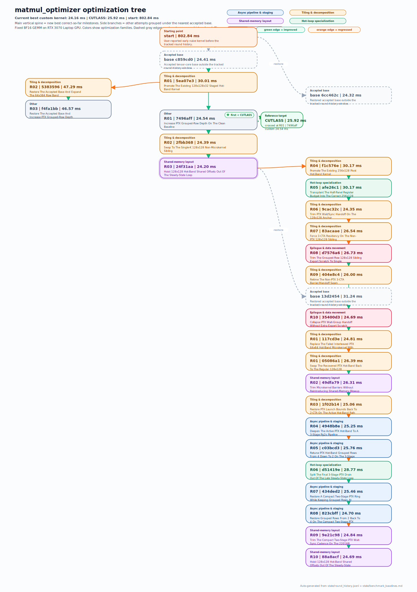

# matmul_optimizer

## Harness Engineering + Human-in-the-Loop: a weekend CUDA matmul project that beat CUTLASS

This repo is the working harness behind a narrow CUDA optimization experiment:

- one fixed BF16 GEMM
- one RTX 3070 Laptop GPU
- one custom kernel path
- one local CUTLASS baseline
- one human-in-the-loop optimization loop

The goal is not to solve general matmul. The goal is to see how far a single engineer can push a shape-specialized kernel, locally, with strong profiling, short iteration loops, and LLM assistance used inside a disciplined harness.

## Repo Snapshot

- benchmark target: `fixed_bf16_gemm_v1`
- shape: `m=6464`, `n=7776`, `k=7232`
- dtype: BF16 inputs, FP32 accumulation, BF16 output reference
- current official best custom runtime: `24.164272 ms`
- current local CUTLASS baseline: `25.917889 ms`
- current gap vs CUTLASS: `-1.753616 ms`, with custom at `0.932340x` the CUTLASS runtime / `6.766049%` faster than CUTLASS
- execution model: local and script-first, with Codex used for diagnosis and implementation
- runtime dependencies: no OpenAI API key, cloud service, or LangGraph runtime required

The authoritative benchmark snapshot lives in [state/benchmark_baselines.md](state/benchmark_baselines.md). The exact workload definition lives in [docs/benchmark_spec.md](docs/benchmark_spec.md).

## Current Operator Entry

For local operator work, start from the lightweight state entrypoints instead of reconstructing context from the whole repo:

- [state/migration_handoff.md](state/migration_handoff.md)
- [state/current_focus.md](state/current_focus.md)
- [state/progress.md](state/progress.md)
- [state/supervisor_task.json](state/supervisor_task.json)

The live loop state changes over time, so use [state/supervisor_task.json](state/supervisor_task.json) and [state/round_loop_state.json](state/round_loop_state.json) as the source of truth for the current dispatch step instead of relying on a hard-coded status line in this README.

## Quick Start

Generate the fixed dataset once:

```bash
python scripts/generate_fixed_bf16_dataset.py
```

Build the main custom-kernel runner:

```bash
cmake -S . -B build -DENABLE_CUTLASS_RUNNER=OFF
cmake --build build -j 4 --target custom_runner
```

Run the local measurement loop entrypoint:

```bash
python scripts/graph.py status
python scripts/graph.py supervisor
python scripts/graph.py node_a
```

Build and measure the optional CUTLASS side-path baseline:

```bash
cmake -S . -B build -DENABLE_CUTLASS_RUNNER=ON -DCUTLASS_ROOT=/path/to/cutlass
cmake --build build -j 4 --target cutlass_runner
python scripts/run_cutlass_baseline.py --runner ./build/cutlass_runner --kernel-tag cutlass_ref_v1
```

If you are operating this repo through Codex or another local agent, the workflow guide now lives outside this README:

- [AGENTS.md](AGENTS.md)
- [docs/codex_workflow.md](docs/codex_workflow.md)
- [docs/supervisor_protocol.md](docs/supervisor_protocol.md)
- [state/README.md](state/README.md)
- [heuristic_dataset/README.md](heuristic_dataset/README.md) for the structured optimization-history dataset that will support heuristic or A*-style search over future tuning directions

## Why I Built It

This started as a weekend project, but it was really a concrete question I wanted to test:

**How far can I push a shape-specialized CUDA kernel in two days, on my own machine, with modern LLMs inside a tight harness?**

I am a GPU performance engineer, not part of NVIDIA, and I did not start by reading CUTLASS internals. I wanted to try something narrower and more practical: pick one fixed BF16 GEMM, on one RTX 3070 Laptop GPU, build a reproducible human-in-the-loop optimization loop, and see how close I could get to a strong reference implementation with limited weekend time.

So far, the result is already interesting enough to share. The custom kernel moved from roughly `800 ms` at the beginning to under `25 ms` on the official benchmark snapshot, with the current best custom run at `24.164272 ms`, while the current local CUTLASS baseline on the same benchmark is `25.917889 ms`. That puts the official snapshot `1.753616 ms` ahead of the local CUTLASS baseline, or `6.766049%` faster in runtime.

That is still not a general "we beat CUTLASS" story. It is one fixed-shape local result, and a proof of concept about harness engineering: with a strong evaluation loop, good profiling, short-context iteration, and human steering at the right moments, a single engineer can move surprisingly far, surprisingly fast.

I care a lot about harness engineering because once models get strong enough, a large part of the problem becomes how to use them well.

For kernel optimization, that means building the surrounding loop:

- fixed benchmark
- reproducible correctness checks
- repeatable runtime measurement
- profiling capture
- structured diagnosis
- controlled implementation attempts
- explicit state tracking across many rounds

That is what this repo is really about. The kernel matters, but the harness matters just as much.

I also think this mirrors a broader engineering trend. Many real workflows are not "solve the general problem." They look more like:

> fixed hardware + fixed workload + fixed objective + limited time + repeated local decisions

That is exactly where a good harness can make LLMs much more useful.

## What I Learned So Far

This project started as a weekend practice, but the part I care about most is not only the final number. It is what this workflow taught me.

### 1. Harness engineering turns raw model capability into engineering progress

Modern LLMs are already powerful. But a powerful model by itself is not the same thing as a productive engineering system.

For this kind of kernel optimization, the leverage comes from the surrounding loop:

- fixed benchmark
- correctness checks
- stable measurement
- profiling capture
- branch tracking
- rollback
- comparison across rounds

The harness is not an accessory around the model. In many cases, it is the layer that turns raw capability into useful work.

### 2. Harness engineering is also memory management

The more rounds I ran, the more I felt that harness engineering is also a memory-management problem.

On the human side, the harness reduces how much state I need to keep in my head:

- which branch tried what
- what regressed
- what plateaued
- what is worth restoring
- what is worth abandoning

On the model side, the harness determines how much useful context the model needs to carry, and how much irrelevant history it can safely forget.

So for me, harness engineering is not just automation. It is also memory management for the engineer and for the model.

### 3. Current LLMs are genuinely useful for incremental optimization

I do not think the right conclusion is "LLMs cannot do performance engineering." My experience here was the opposite in a narrower setting.

Current models are already very helpful for:

- incremental improvements
- implementation work
- local diagnosis
- turning profiler observations into code changes
- iterating quickly inside a bounded branch

That part is real.

### 4. But they can still get trapped in local minima

The models can keep improving the wrong area.

They can spend many rounds fine-tuning a non-pivot issue, collect a few smaller wins, and still end up on a plateau that is not strategically helpful. In other words, the model may still be "improving," but not in a way that changes the overall outcome very much.

That is why I kept using human idea changes and broader out-of-box discussion to keep the search moving forward.

One of my strongest takeaways is this: today's models are already good at local optimization, but they are not automatically good at choosing the right optimization direction.

### 5. Profiling tools feel like pre-harness LLMs

Before people figured out how to use modern LLMs well, the models were already powerful. They just lacked the right harness.

Profiling tools feel similar to me:

- already powerful
- historically aimed at human-only use
- high learning curve
- plenty of signal that is still underused

So profiling tools today feel a bit like LLMs before better harness engineering: already strong, still waiting for better frameworks to make them even more useful.

### 6. One future user of the profiler may be the model

If the profiler already exposes rich signals, and we now understand much more about building loops around powerful models, one obvious next step is that the model becomes an active user of the profiling tool.

Concretely, that means:

- read the profiler output
- connect it to hardware utilization
- estimate likely bottlenecks
- prioritize branches
- reject low-upside directions
- propose the next implementation move

That is one reason this area feels so interesting right now.

### 7. Short context often helps more than long context

Longer context is not automatically better.

For this kind of project, long context often does not add more useful information. Sometimes it hurts:

- too many stale ideas
- too many mixed branches
- diluted priorities
- harder handoff
- weaker decisions

Short context with the right summary is often much better. For many optimization loops, the better default is: compress hard, keep the signal, drop the rest.

### 8. Critical thinking matters more, not less

As models get stronger, I do not think the engineer becomes less important. I think the engineer's role becomes more centered on critical thinking.

Especially:

- building the evaluation matrix
- deciding what to measure
- deciding what to trust
- separating real bottlenecks from side signals
- deciding when to continue, branch, revert, or stop

The model can generate options. The engineer still needs to judge which options are worth spending time on.

### 9. Tool setup matters, and I intentionally kept this one narrow

Part of the point of this project is that I wanted the setup to be constrained and honest.

For transparency:

- I did not start by reading CUTLASS code
- I mainly used `GPT-5.4` and Codex CLI
- I also used `GPT-5.4 Pro` in chat for discussion and idea exploration
- the main optimization workflow was not "just ask a model to solve everything"

I wanted to see what happens when a strong model is placed inside a good harness, on a very specific problem, with a human still steering direction.

### 10. Better models may create more engineering surface, not less

The current level of CUDA optimization is already the result of strong engineers pushing close to the limit of human working memory.

A lot of this work is difficult not because the machine is mysterious, but because the optimization stack is deep and people cannot keep every layer active in their head at once.

That is why abstraction matters. We need different levels of abstraction to preserve key principles while making the problem tractable.

In that sense, I do not see better models as reducing the need for engineers. I can easily imagine the opposite: engineers get more opportunities because the system makes it possible to work at more layers and search more paths.

### 11. CUDA is only one layer; future loops may move closer to PTX

CUDA is already an abstraction layer. Under it there is PTX, and below that there is even more hardware reality.

If stronger harnesses and better model-tool loops make lower-level work more tractable, then one interesting direction is human-in-the-loop PTX optimization.

Not because abstraction is bad, but because better abstractions may finally let more people operate closer to the machine without losing the global reasoning.

### 12. The optimization history itself became useful

Once the project accumulated many rounds, the history itself started to carry structure.

The rounds are not just a log. They reveal families of attempts:

- tiling and CTA-shape ideas
- staging, async-copy, and pipeline ideas
- shared-memory layout ideas
- epilogue and writeback ideas
- fixed-shape specialization ideas
- human idea changes

That is why I wanted the optimization tree in the write-up. It is not decoration. It makes the search process visible.

### 13. The next bottleneck may be search policy

In human-in-the-loop kernel optimization, the search space is huge, and the real cost is not only kernel coding speed. It is the time spent deciding which path to explore next.

Looking at the optimization tree, I realized that my current workflow is still basically a single-path search with rollback: push one direction until it plateaus, step back, then try another branch.

That works, but it is not an efficient way to use the information accumulated across the whole search.

So the next step is probably not only "write better kernels faster." It is to make better choices about which path to explore next while keeping multiple candidate states alive instead of collapsing too early onto one branch.

That is why I want to explore ideas like:

- keeping multiple kernel variants in a queue
- estimating upper and lower bounds from profiler signals
- using heuristic planning
- using A-star-like search structures
- using RL-style search policies to allocate iteration effort more intelligently

In other words, the next layer is not only kernel optimization. It is optimization of the optimization process itself.

## Current Snapshot



This repo is intentionally narrow:

- one fixed BF16 GEMM shape
- one machine
- one custom kernel path
- one local CUTLASS baseline
- one evolving optimization tree

That narrowness is the point.

I am not trying to claim a general matmul breakthrough. I am trying to test how far harness engineering, profiling, human steering, and LLM assistance can go in a realistic constrained setup.

The tree asset below is regenerated from the latest tracked round history in the repo, which now spans `271` recorded measurement rounds, so it reflects the latest exploratory commits while keeping the official best snapshot anchored to the current recorded-best commit `489574e`.

At the moment, the official benchmark snapshot in the repo is:

- custom kernel: `24.164272 ms`
- local CUTLASS baseline: `25.917889 ms`
- result: `1.753616 ms` faster than CUTLASS, or `6.766049%` lower runtime, enough to show the harness can cross a strong local baseline on one fixed problem while still leaving room to validate and extend the win

## Major Workflow Updates

- [x] Checkpoint - Apr 20, 2026: next-direction search moved to a persistent family-representative frontier (`ce7a092`, with supporting migration in `51c80ca`)

  The current exploration format is no longer "pick only from the latest 3 ideas." `node_b` still emits exactly 3 fresh directions into `state/search_candidates.json`, but those directions are merged into a persistent `state/search_frontier.json` instead of replacing it. Each idea family exposes at most one active representative at a time, sibling candidates are parked inside the same family, and `select-next` competes only across those active representatives. Older candidates can reopen only under bounded near-miss rules, so the loop can revisit promising historical work without turning selection into a full rescore over every past attempt. In practice this is a heuristic, candidate-centric, A*-like frontier rather than a full A* implementation; the detailed policy lives in [docs/search_policy.md](docs/search_policy.md).

- [x] Checkpoint - Apr 20, 2026: multi-round loops now force a context-compression checkpoint every 5 completed rounds (`d815ad9`)

  Long-running rounds were starting to accumulate stale state and occasionally get stuck in overly long context. The supervisor now refreshes `state/supervisor_context.md` every 5 completed rounds, records the current dispatch node, accepted base, and active candidate, and then immediately continues the loop. The checkpoint is explicitly a continue point, not a natural stopping point.

- [x] Checkpoint - Apr 20, 2026: optimization history now has a machine-readable heuristic dataset (`8049817`, refreshed in `51c80ca`)

  `heuristic_dataset/` exports diagnosis options, implementation attempts, profiler effects, and measured outcomes into JSONL snapshots. That makes the search history usable as data instead of only prose, and it sets up later work on frontier ranking, reopen rules, and learned search behavior.

- [ ] TODO - next search-policy layer

  Use the accumulated heuristic dataset to test RL-style improvements on top of the current A*-like family frontier: learn better family priors, reopen budgets, and exploration-vs-exploitation scheduling instead of relying only on hand-set heuristics.

- [ ] TODO - make workflow state transitions deterministic scripts instead of agent judgments

  The current agent flow still leaves part of the execution path in the hands of the model. One identified failure mode was that the agent received the correct Markdown instructions but still got stuck because of model drift under long context / annealing pressure. The fix should be structural: keep diagnosis and implementation in the agent, but move node dispatch and state-transition control into deterministic repo-local scripts so the loop cannot stall just because the model misread or mis-prioritized a long prompt.

- [ ] TODO - add a host-level resident supervisor runner

  The current protocol now marks active-loop continue points machine-readably, but it still depends on a live top-level Codex supervisor process to consume that state. To keep long round loops running across SSH disconnects, IP changes, or terminal loss, add a host-level resident executor around `python scripts/graph.py supervisor` that survives shell/session churn, re-reads `state/supervisor_task.json`, honors the continue contract, and resumes the active dispatch step until the round budget is exhausted or the user explicitly redirects the workflow.

## Document Map

This README is intentionally public-facing now. The workflow-specific and Codex-specific operating details live in narrower docs:

- [AGENTS.md](AGENTS.md): repo-local instructions for Codex and other coding agents
- [docs/codex_workflow.md](docs/codex_workflow.md): operator quickstart for the local optimization loop
- [docs/supervisor_protocol.md](docs/supervisor_protocol.md): supervisor dispatch contract
- [docs/node_b_protocol.md](docs/node_b_protocol.md): diagnosis-node protocol
- [docs/node_c_protocol.md](docs/node_c_protocol.md): implementation-node protocol
- [docs/pipeline_graph.md](docs/pipeline_graph.md): workflow graph semantics
- [docs/benchmark_spec.md](docs/benchmark_spec.md): fixed benchmark definition
- [state/README.md](state/README.md): state file meanings and update rules
- [blog/harness-engineering-human-in-the-loop-cuda-matmul/index.md](blog/harness-engineering-human-in-the-loop-cuda-matmul/index.md): original blog draft stored in-repo
