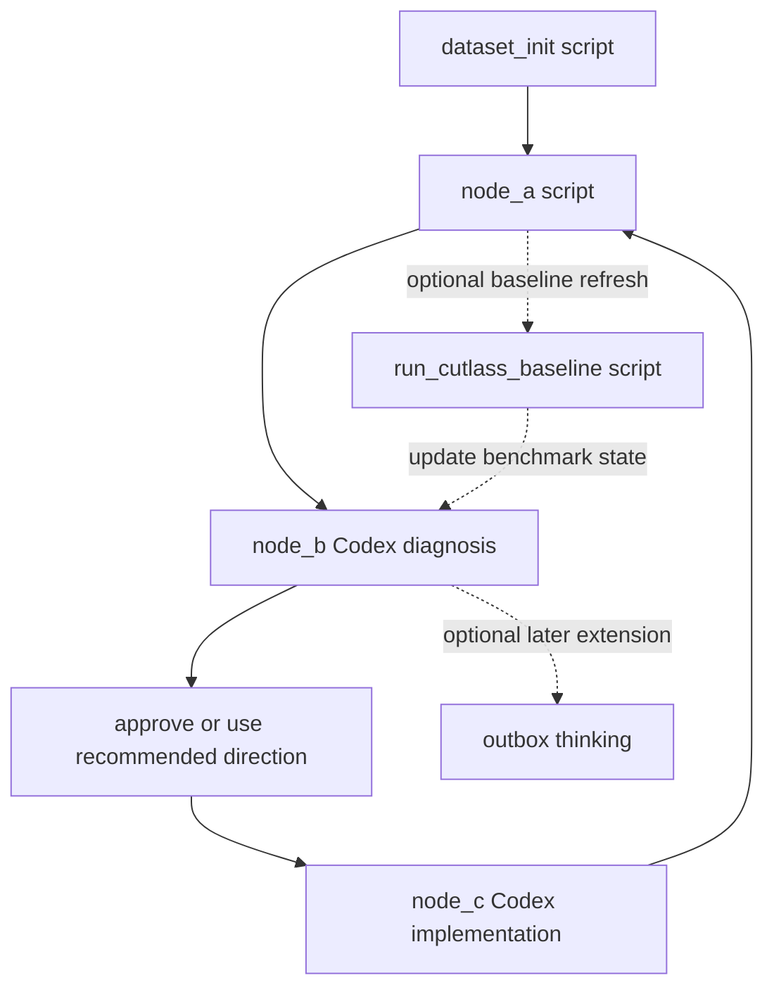

# Pipeline graph

This repo uses a lightweight, LangGraph-inspired workflow:

```text
dataset_init -> node_a -> node_b -> node_c -> node_a
```

Only the state / node / edge idea is borrowed. The execution path stays local and script-first.

## Design principles

- execution-critical steps stay in scripts
- reasoning-heavy steps are Codex-friendly agent nodes
- machine-readable state and human-readable state are both required
- git is the audit log for measured runs, diagnoses, and implementations
- optional multi-round loop state can budget repeated node_b -> node_c -> node_a rounds
- CUTLASS is a side-path baseline node, not part of the main loop

## Graph sketch



## Node semantics

## `dataset_init`

One-time or rare setup node.

Responsibilities:

- generate the fixed dataset
- populate `artifacts/datasets/fixed_bf16_gemm_v1/`

## `node_a`

The fully script-first measurement node.

Responsibilities:

- run outside the Codex sandbox so CUDA benchmarking and Nsight Compute can reach the GPU
- build `custom_runner` if needed
- run `scripts/eval_kernel.py`
- record correctness / performance / Nsight Compute
- keep raw artifacts under `runs/`
- write lightweight summaries under `state/`
- update `state/graph_state.json` so the next node is `node_b`
- create a `node_a:` commit with lightweight state only

Key outputs:

- `state/latest_run.json`
- `state/latest_ncu_summary.json`
- `state/latest_run.md`
- `state/latest_ncu_summary.md`
- `state/graph_state.json`

## `node_b`

The diagnosis node.

Responsibilities:

- read the latest lightweight run summary
- read the latest lightweight NCU summary
- read `docs/heuristics.md`
- read the current kernel
- output exactly 3 optimization directions
- set one `recommended_direction_id`
- update graph state so the workflow points at `node_c`
- create a `node_b:` commit with lightweight state only

Key outputs:

- `state/latest_diagnosis.json`
- `state/human_review.md`
- `state/node_c_context.md`

## `node_c`

The implementation node.

Responsibilities:

- read the selected direction
- implement exactly one direction
- build before claiming success
- stop and update failure state if the build fails
- commit code plus lightweight state after build success
- auto-run `node_a` by default

Guardrails:

- one direction per loop
- no automatic merge
- no performance claim before node_a re-measures

## Side node: `run_cutlass_baseline`

Responsibilities:

- measure the CUTLASS reference path on the same dataset
- refresh the benchmark target
- update benchmark state and human-readable baseline notes

This node is intentionally **off the execution-critical path**.

## State model

## Machine-readable state

- `state/graph_state.json`
- `state/latest_run.json`
- `state/latest_ncu_summary.json`
- `state/latest_diagnosis.json`
- `state/active_direction.json`
- `state/benchmark_state.json`
- `state/run_registry.jsonl`
- `state/round_loop_state.json`
- `state/round_history.jsonl`

## Human-readable state

- `state/latest_run.md`
- `state/latest_ncu_summary.md`
- `state/progress.md`
- `state/current_focus.md`
- `state/human_review.md`
- `state/benchmark_baselines.md`
- `state/rounds.md`
- `state/node_b_context.md`
- `state/node_c_context.md`

The two layers must not contradict each other.

## Git as workflow memory

Git commit classes:

- `node_a:` measured state
- `node_b:` diagnosis state
- `node_c:` implementation after build success

When a multi-round loop is active, the node commits should carry the round label, and the node_a commit should record:

- modification idea
- runtime delta
- TFLOP/s delta
- run dir
- profile paths

This keeps the workflow auditable without committing raw artifacts.

## Outbox thinking

Outbox thinking remains intentionally small in this retrofit.

Keep it as a later extension for:

- branch-heavy exploration
- larger architectural rewrites
- ideas that should not enter the main loop immediately
