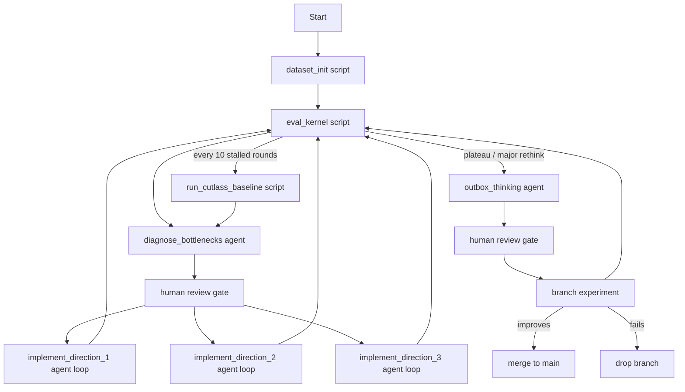

# Pipeline graph (LangGraph-inspired, script-first)

The repo borrows the **node / edge / state** framing, but only uses agents where reasoning actually matters.

## Design principle

- deterministic execution steps -> **scripts**
- interpretation / diagnosis / idea generation -> **agents**
- acceptance / rejection / merge -> **human-in-loop**

This keeps token cost low and makes the benchmark path reproducible.

## Graph sketch

## Nodes

## `dataset_init` (script)

One-time or rare node.

### Responsibilities

- read `configs/fixed_bf16_gemm_v1.json`
- generate deterministic BF16 input tensors and stored references
- write local dataset artifacts
- write checksums and manifest copy

### Inputs

- dataset config JSON

### Outputs

- `artifacts/datasets/fixed_bf16_gemm_v1/...`

---

## `eval_kernel` (script)

This is the script version of the original `agent_a`.

### Responsibilities

- compile or call the provided kernel runner
- warm up GPU
- flush scratch/cache between runs
- run correctness on all configured correctness cases
- run timing on the benchmark case
- launch Nsight Compute
- write:
  - raw logs
  - `.rep`
  - NCU CSV/raw summary
  - machine-readable JSON summary
  - human-readable Markdown summary

### Reads

- dataset manifest
- current kernel binary or source build output
- benchmark config
- optional current baseline summary

### Writes

- `runs/<timestamp>_<kernel_tag>/summary.json`
- `runs/<timestamp>_<kernel_tag>/summary.md`
- `runs/<timestamp>_<kernel_tag>/ncu_profile.rep`
- `runs/<timestamp>_<kernel_tag>/ncu_metrics.csv`
- `runs/<timestamp>_<kernel_tag>/ncu_summary.json`
- `runs/<timestamp>_<kernel_tag>/ncu_summary.md`

---

## `diagnose_bottlenecks` (agent)

This is the first half of `agent_b`.

### Responsibilities

- read the latest profile
- identify under-utilized hardware or obvious stalls
- cross-reference `docs/heuristics.md`
- output **exactly three** candidate optimization directions

### Required output format

For each direction:

1. hypothesis,
2. expected bottleneck relieved,
3. code areas to change,
4. risk,
5. metrics to re-check after implementation.

---

## `implement_direction_i` (agent loop)

This is the second half of `agent_b`.

### Responsibilities

- choose one approved direction
- edit kernel code
- compile
- run `eval_kernel`
- stop if compile fails, correctness fails, or performance regresses badly
- document the change in progress state
- prepare a candidate git commit message

### Guardrails

- one direction per loop
- no automatic merge to `main`
- human review before keeping a performance claim

---

## `run_cutlass_baseline` (script)

This is the mostly-script version of `agent_c`.

### Responsibilities

- run the CUTLASS reference kernel on the same dataset
- record correctness, timing, and NCU artifacts
- maintain the current official baseline
- refresh the baseline periodically

### Recommended cadence

- run early to establish the target
- rerun after major kernel changes
- rerun every ~10 stalled or non-improving optimization rounds

---

## `outbox_thinking` (agent)

This is `agent_d`.

### Responsibilities

- read git history and current bottlenecks
- compare custom kernel behavior with CUTLASS profile behavior
- propose larger-step ideas that were not obvious from local hill-climbing
- interact with a human more directly
- test only on a feature branch unless explicitly approved otherwise

## Edges

## Main deterministic edges

- `dataset_init -> eval_kernel`
- `eval_kernel -> diagnose_bottlenecks`
- `implement_direction_i -> eval_kernel`

## Human-gated edges

- `diagnose_bottlenecks -> implement_direction_i`
- `outbox_thinking -> branch experiment`
- `branch experiment -> merge to main`

## Plateau edge

- `eval_kernel -> run_cutlass_baseline` when incremental improvements stall

## State

In this repo, “state” is deliberately human-readable whenever possible.

## Human-readable state files

- `state/progress.md`
- `state/current_focus.md`
- `state/human_review.md`
- `state/benchmark_baselines.md`

## Structured state / machine-readable state

- `configs/*.json`
- dataset manifests
- run summaries under `runs/`
- optional structured experiment logs later

## Git as long-term memory

Git stores:

- why a kernel changed,
- what hypothesis motivated the change,
- what performance changed,
- what profile evidence supported it,
- and when a branch-level idea should be kept or rejected.

## Rules for `main`

Only merge to `main` when all of the following are true:

1. build succeeds,
2. correctness passes,
3. timing is re-measured,
4. change is documented,
5. the claimed improvement is clear.
